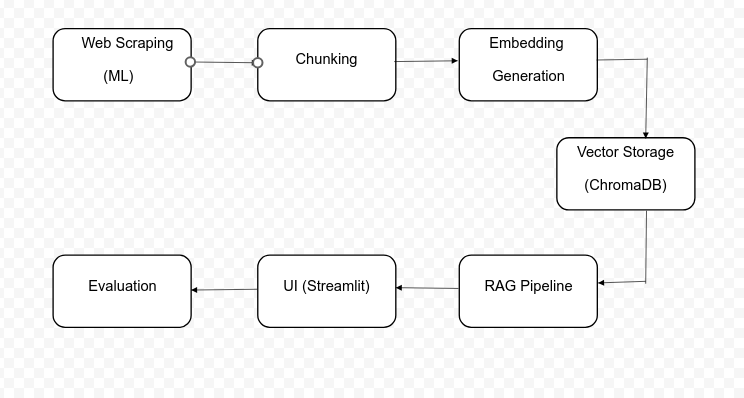

## ML-RAG Chatbot: A Machine Learning Knowledge Assistant
This project implements a Retrieval-Augmented Generation (RAG) chatbot designed to provide answers on Machine Learning topics using Wikipedia data. It leverages ChromaDB for vector search, meta-llama/Llama-3.2-1B-Instruct for response generation, and a Streamlit UI for interaction.

### Overview
- Scrapes Wikipedia pages on ML topics (e.g., CNNs, GANs, Reinforcement Learning).
- Processes and stores embeddings in ChromaDB for efficient retrieval.
- Uses RAG pipeline to generate responses based on relevant context.
- Evaluated using 1100 test cases with metrics like BLEU, ROUGE, and Cosine Similarity.
- Implements query logging for tracking interactions.
- **Unit testing added** to validate pipeline components.

### Features
- **Data Scraping**: Extracts machine learning-related content from Wikipedia.
- **Data Preprocessing**: Cleans and processes scraped text for embedding generation.
- **Vector Storage**: Stores embeddings in ChromaDB for fast retrieval.
- **RAG Pipeline**: Retrieves context and generates responses using meta-llama/Llama-3.2-1B-Instruct.
- **User Interface**: Streamlit-based UI for user interaction.
- **Evaluation**: Tested on 1100 test cases using multiple evaluation metrics.
- **Logging**: Tracks queries, responses, and retrieved contexts.
- **Unit Testing**: Ensures reliability of data retrieval, embedding generation, and response accuracy.

### Getting Started
Run the chatbot:
```bash
streamlit run app.py
```

### Unit Testing
Unit tests are implemented to verify the core components of the chatbot:
- **Scraper Tests**: Validate data extraction from Wikipedia.
- **Embedding Tests**: Ensure embeddings are generated correctly.
- **Retrieval Tests**: Confirm accurate context retrieval from ChromaDB.
- **Response Tests**: Check LLM-generated answers for coherence and correctness.

Run unit tests:
```bash
python3 -m unittest discover -s tests -p "*.py"
```

### Architecture Diagram



### Documentation
For a detailed explanation of the RAG pipeline, evaluation metrics, and implementation, refer to the [Project Documentation](https://shorthillstech.sharepoint.com/:fl:/g/contentstorage/x8FNO-xtskuCRX2_fMTHLR8LXR-iUzJIsAKA6SsYafI/ESb5ngM0q0tAjuqYow0oUDcBZdO87scTWNd76xfUbaRPGg?e=NUdhJj&nav=cz0lMkZjb250ZW50c3RvcmFnZSUyRng4Rk5PLXh0c2t1Q1JYMl9mTVRITFI4TFhSLWlVekpJc0FLQTZTc1lhZkkmZD1iJTIxSUhTOWtrdVh3RVNnNFV2R1J5ekVJM2tyU0hGdEh6VlByZTU3UUVsdE1XemVad3JBRlVEVlNabWdRVFBmb2tCayZmPTAxVTVKRUNNSkc3R1BBR05GTEpOQUk1MlVZVU1HU1FVQlgmYz0lMkYmYT1Mb29wQXBwJnA9JTQwZmx1aWR4JTJGbG9vcC1wYWdlLWNvbnRhaW5lciZ4PSU3QiUyMnclMjIlM0ElMjJUMFJUVUh4emFHOXlkR2hwYkd4emRHVmphQzV6YUdGeVpYQnZhVzUwTG1OdmJYeGlJVWxJVXpscmEzVllkMFZUWnpSVmRrZFNlWHBGU1ROcmNsTklSblJJZWxaUWNtVTFOMUZGYkhSTlYzcGxXbmR5UVVaVlJGWlRXbTFuVVZSUVptOXJRbXQ4TURGVk5VcEZRMDFNV0ZGQlZrOVVSMU5TVFZwRU1rRXlSRkpRVVU5V05VMDFRZyUzRCUzRCUyMiUyQyUyMmklMjIlM0ElMjIwYzgwOWNhZC1iOGM2LTRkYjYtYTM4Mi05MGZjYTQ5NTcwOGYlMjIlN0Q%3D).
